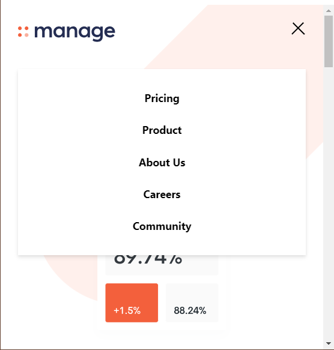
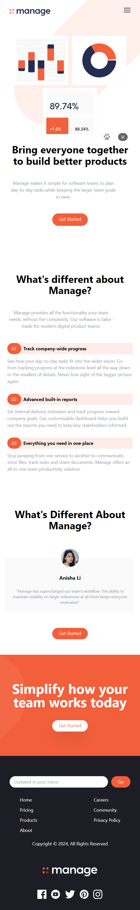
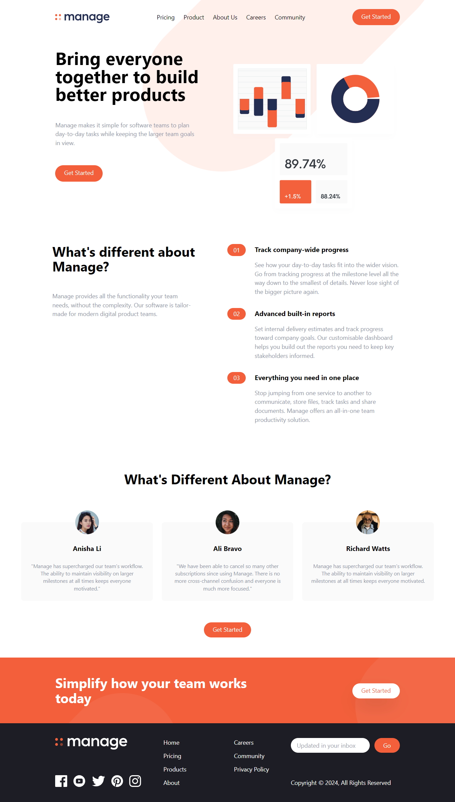

# Manage Landing Page - Frontend Mentor

## Details

### Brief description

This is a HTML, Tailwind css project. Showing a landing page. This is a challenge from Frontend Mentor at this [link](https://www.frontendmentor.io/challenges/manage-landing-page-SLXqC6P5).

### Technologies used

html, tailwindcss

## Getting Started

### Pre-requisites

Node.js, NPM, code editor like VSCode.

### Install project dependencies/devDependencies

```bash
npm install
```

### Run project

Run this command in terminal, if you want to make changes in file.

```bash
npm run watch
```

Open `./src/index.html` file with your browser to see the result.

## Screenshots

### Hamburger menu



### Landing page Mobile view



### Landing page Desktop view


